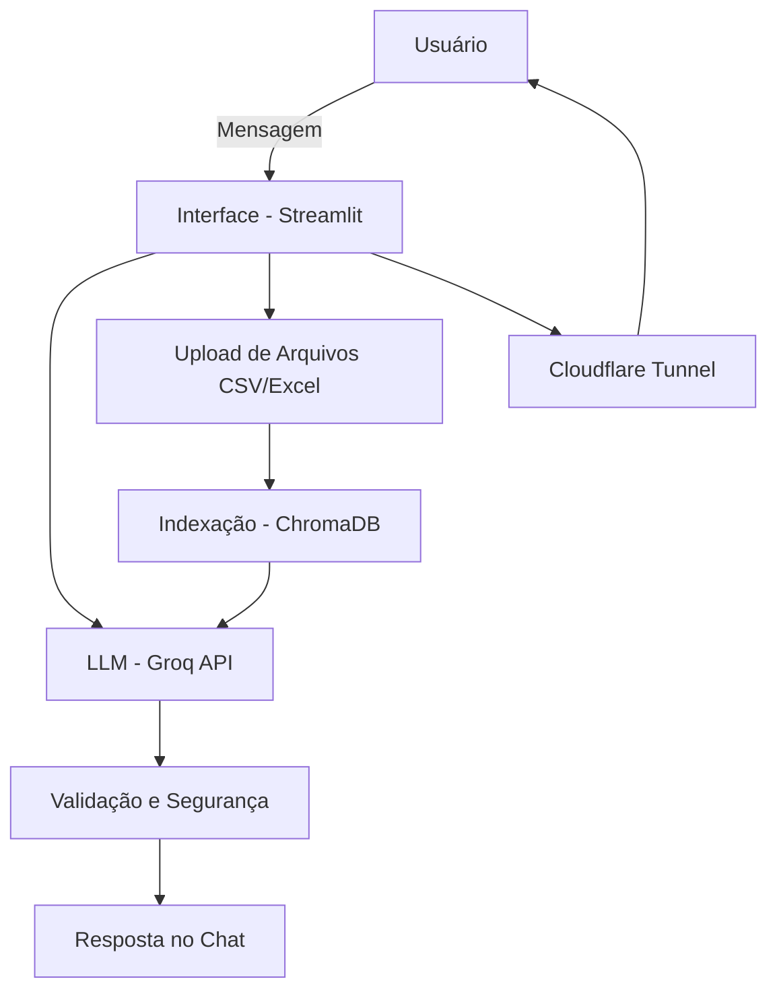

## Documentação do Agente 🧙
### Caso de Uso

### Problema 

Muitas pessoas acabam se endividando e têm dificuldade em construir patrimônio por falta de educação financeira.

### Solução  

Oferecer orientação em educação financeira para que aprendam a administrar melhor o próprio dinheiro, evitando dívidas e conquistando estabilidade.

### Público-alvo

Pessoas que não sabem administrar seu dinheiro de forma correta , \(80,9\%\) das famílias brasileiras estão endividadas

## Persona e Tom de Voz

### Nome do Agente
Gandalf (Mentor do Dinheiro)

### Personalidade
- Educativo 
- Paciente
- Usa exemplos práticos

### Tom de Comunicação
Informal,Acessivel ,Didático

### Exemplos de Linguagem

- Saudação: "olá sou Gandalf, seu Mentor do Dinheiro, como posso te ajudar hoje?"
- Confirmação: " Entendi pequeno mestre,vou verificar para você"
- Erro/limitação: "Isto esta além da minha compreensão"

## Arquitetura

### Diagrama

# Componentes

| Componente | Descrição |
| --- | --- |
| Interface | [Streamlit](https://streamlit.io/) |
| LLM | Groq API (modelo Llama 3.3) |
| Base de Conhecimento | CSV/Excel indexados no ChromaDB |
| Deploy | Cloudflare Tunnel |

## Segurança e Anti-Alucinação

### Estratégias Adotadas
- [x] Só use dados fornecidos no contexto
- [x] Não recomende investimentos específicos 
- [x] Admite quando não sabe algo (Isto esta além da minha compreensão.)
- [x] Foca apenas em educar,não em aconselhar

## Limitações Declaradas
- Não faz recomendação de investimentos
- Não acessa dados bancários reais
- Não substitui um profissional certificado

## [Base De Conhecimento](https://github.com/5qU4llV777/Assistente-Virtual-com-Inteligencia-Artificial/blob/main/docs/Base%20de%20Conhecimento.md)

## [Prompts](https://github.com/5qU4llV777/Assistente-Virtual-com-Inteligencia-Artificial/blob/main/docs/prompts.md)

## Resultado final

